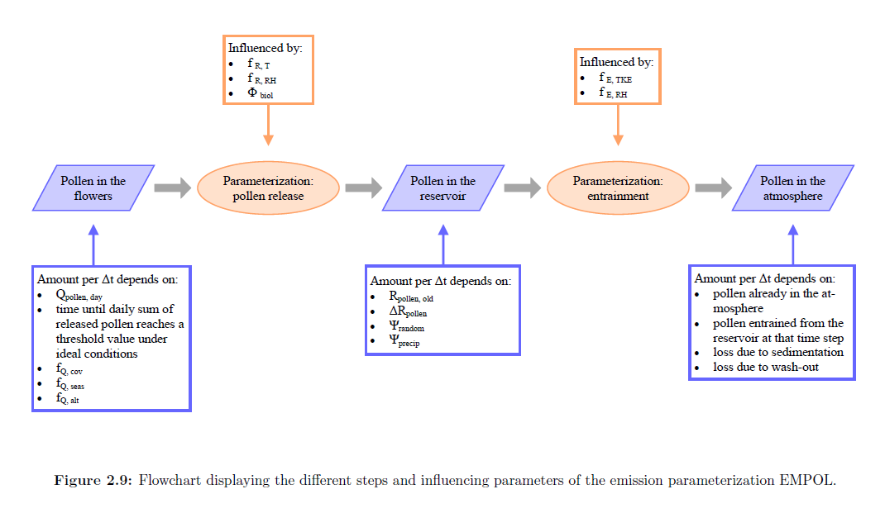

```{r echo = FALSE}
knitr::opts_chunk$set(echo = FALSE,
                      error = FALSE, 
                      warning = FALSE, 
                      message = FALSE,
                      fig.retina =3,
                      fig.width = 10,
                      fig.height = 7,
                      fig.align = "center",
                      out.width = "100%",
                      out.height = "100%")
```

# Einleitung

Im Projekt CHAPo werden automatische Pollenmessgeräte auf dem ganzem Gebiet der Schweiz installiert. Diese neuartigen Fallen werden von der Firma Swisens produziert und tragen den Namen Poleno. Der grosse Vorteil für die Prognose-Modelle liegt in der Verfügbarkeit der Daten; diese werden ab 2021 in Echtzeit an das Rechenzentrum der Meteoschweiz gesendet. Zudem konnten die Poleno Fallen in einem ersten Vergleich auch zeigen, dass sie bereits bei geringeren Pollen-Konzentrationen robuste Messungen ermöglichen. In bisherigen Analysen wurden die Messorte für die neuen Fallen und wichtige Meilensteine des Projekt CHAPo definiert. Dieses Dokument soll nun aufweisen inwiefern die Prognose-Modelle (z.B. COSMO-1e) am meisten von den neuen Daten profitieren können. Dazu werden Module und Code-Stellen der Cosmo Code-Datenbank ausgewählt, die am ehesten von den zeitlich höher aufgelösten Daten profitieren könnten. Des Weiteren soll dieses Dokumen folgende Fragestellungen näher beleuchten:

- Welche Parameter / Funktionen sollen von der neuen Daten Assimilation profitieren?
- Wie häufig soll der jeweilge Parameter / Funktion an die momentanen Messwerte angepasst werden?
- Kann dieselbe Methode für alle relevanten Pollentaxa verwendet werden?
- Wie soll räumlich zwischen den rund 40 Stationen interpoliert werden?
- Wie kann die Güte der neuen Methoden überprüft werden (was dient als "Ground-Truth")?
- Welche externen Schnittstellen und Anhängigkeiten existieren und sollten definiert werden?
- Wie viel zusätzliche Computing-Resourcen werden benötigt?

# Module und Parameter

Die Pollen sind anhand des folgenden Schemas in COSMO-ART implementiert.

```{r}

```

Die Bedeutung der Symbole und das Diagramm stammen von Zink, 2014.

```{r out.width="75%"}
knitr::include_graphics("figures/parameters.png")
```

Folgende Teilgebiete der Pollen-Implementierung könnten von den neuen Echtzeit-Daten profitieren und sind verantwortlich für den grössten Teil der Unsicherheiten in der numerischen Pollenvorhersage:

- Phänologie: Beginn (und Ende) der Pollensaison von den real-time Pollendaten triggern (oder verzögern) (z.B. via variables Feld der kritischen Temperatursummen)
- Stärke der Pollensaison: Identifikation von Mastjahren und Anpassung der maximalen Emissions-Menge. Momentan wird ein konstanter tuning-faktor in einer namelist definiert. Diesen könnte man als variables Feld aufspannen (indirekte Skalierung der Verbreitungskarte) 

Die modellierte Pollenkonzentration in der Luft kann dabei nicht einfach näher an die Messwerte gezogen werden (Nudging der Messwerte), da diese Information schnell verloren geht, vielmehr müssen Emissions-Parameter angepasst werden (Nudging der Parameter).

In Bezug auf das Diagramm oben kommen also Die folgenden beiden Parameter als Kandidaten für Echtzeit Anpassungen in Frage:

- Mathematical description of the course of the pollen season \\(f_{Q,seas}\\); wird dem Modell als Grid-Inputfeld bereit gestellt (Verbreitungskarte). Durch einen variablen Tunigfaktor könnte dieses Feld indirekt skaliert werden. 
- Fraction of the grid box covered with the specific plant \\(f_{Q,cov}\\); Der zweite Parameter, die Saisonalität der Pollenphänologie, wird im Modul pol_seasons jeweils berechnet und kann direkt optimiert werden.

Das übergeschaltete Modul im Pollen-Code heisst "organize_pollen", das eine grosse Anzahl Subroutinen des Pollen-Codes aufruft. 

```{r}
knitr::include_graphics("figures/organize_pollen_cgraph.png")
```

Die beiden oben genannten Parameter werden also über den folgenden Weg aufgerufen:

- lmorg -> organize_pollen -> pol_emissions::emiss_p -> emiss_formula_zink (für \\(f_{Q,cov}\\))
- lmorg -> organize_pollen -> pol_seasons::calc_saisl (für \\(f_{Q,seas}\\))

Das Modul pol_seasons wird momentan immer um 14:00 UTC aufgerufen während eines Modelllaufs, die Phänologie wird also nur einmal pro Tag aktualisiert. Das Modul pol_emissions wird alle 10-Minuten aufgerufen.

## Die Saisonalität

Die mathematische Beschreibung der Pollensaison \\(f_{Q,seas}\\) ist dem phänologischen Modell entnommen, das für die operationellen numerischen Pollenvorhersagen an der MeteoSchweiz entwickelt wurde. Es wird in beiden Modellkonfigurationen als Eingangsparameter für die Emissionsparametrisierung verwendet. Siehe Abschnitt 3.3.3 in Zinks Dissertation für weitere Informationen. [Zink, 2014]

Im Modul pol_seasons wird \\(f_{Q,seas}\\) bereit gestellt. In der letzten Subroutine des Modules, genannt calc_sdes könnten die zuvor geladenen Echtzeit-Daten implementiert werden. An dieser Stelle könnten zwei Temperatursummerfelder optimiert werden und variabel gemacht werden (tthrs_red and tthrs). Diese beiden Felder existieren bereits im Code sind aber zeitlich fixiert. Sie werden in data_pollen definiert, in organize_pollen alloziert und in pol_seasons mit Inhalten gefüllt.

```{fortran eval = FALSE, echo = TRUE}
MODULE pol_seasons

!This module calculates the phenological state of the plants (Variable f_q_seas) that
!is used in the pollen emission calculation (module pol_emissions). f_q_seas is zero
!before and after the pollen season. During the pollen season it ranges from
!zero and  (almost) one. The higher f_q_seas the more plants are flowering.
!
!The current implementation includes birch, alder and grasses. For birch and alder, a temperature
!sum model for the start and the end of the pollen season is provided. This model is optimized
!for Swiss pollen data. For grasses, the implemented approach includes a temperature sum model
!for the start of the pollen season. The end of the pollen season is calculated via the
!climatological length of the grass pollen season. Most of the subroutines can
!handle further species some have to be adapted though. For one further species
!(Ambrosia or any other) the structures are already implemented.

USE data_pollen,        ONLY: isp, isp_pollen, var_pollen, jul_days_excl, t_base, &
                              ctsum, t2m_act_field_path, t2m_clim_stns_path,      &
                              tthrs, tthre, f_q_seas, saisn, saisa,               &
                              saisl, dtpollen

SUBROUTINE calc_saisl(ierrstat)

! initialize some allocated objects
    t2m_norm_stns = REAL(array,wp)
    stns_i   = NINT(header_info%grid_i,iintegers)
    stns_j   = NINT(header_info%grid_j,iintegers)
    stns_lon = REAL(header_info%longitude,wp)
    stns_lat = REAL(header_info%latitude,wp)
  
  
    ! calculate the length of the season at the 31 stations using a) saisn, b) ctsum,
    ! c) clim. station t2m data gather fields to select t2m values at stations
    CALL gather_field (tthrs_red(:,:,isp), ie,je, thr_s_tot, ie_tot,je_tot, -1, ierrstat)

    ! get thresholds for ctsum at the stations from the whole field
      thr_s_stns_tmp1(stn) = thr_s_tot(stns_i(stn),stns_j(stn))

    thr_s_stns = SPREAD(thr_s_stns_tmp1, 2, tomorrow_end_clim)

    ! Select t_2m climatology tomorrow to 31 May
    t2m_clim_stns = t2m_norm_stns(:,nzjulianday - iarray(1,1) + 2 : size(iarray))
  
    ! Set t_2m < t_base(isp) to zero and calculate weighted temperature sum
    WHERE (t2m_clim_stns < t_base(isp)) t2m_clim_stns = 0._wp
  
    ! length of the season = past days during season and coming days until end of season
    saisl_stns = saisa_stns + SUM(sais_clim_stns, DIM=2)
  
    ! interpolate saisl_stns onto gridpoints with inverse distance weighting
    stns_lon_rad = stns_lon * pi / 180.0_wp
    stns_lat_rad = stns_lat * pi / 180.0_wp
  
    rlon_vec = RESHAPE(rlon,  (/ie*je,1/))
    rlat_vec = RESHAPE(rlat,  (/ie*je,1/))
  
    DO grdpnt=1,ie*je
      diff_lon = (rlon_vec(grdpnt,1) - stns_lon_rad) * COS(rlon_vec(grdpnt,1)) !XXXXXXXX BUG sollte rlat_vec sein
      diff_lat = rlat_vec(grdpnt,1)  - stns_lat_rad
      dist = sqrt(diff_lon * diff_lon + diff_lat * diff_lat)
      ! inverse distance weighting
      saisl_vec(grdpnt) =  SUM((1._wp/dist) * saisl_stns) / SUM(1._wp/dist)
    END DO
  
    saisl(:,:,isp) = RESHAPE(saisl_vec, (/ie,je/))

END SUBROUTINE calc_saisl

```

Es wäre von Vorteil diese Routine häufiger als alle 24h auszuführen. Wenn man beispielswiese alle 3 Stunden diese Routine ausruft (also für jeden operationellen COSMO-1e Lauf), kann der Blühbeginn in Stationnähe ziemlich genau den Messungen angepasst werden.

## Die Verbreitungskarte

Wie oben erwähnt wird nicht die Karte direkt skaliert sondern viel eher könnte eine tuning Faktor immer bei runtime definiert werden. Beispielsweise für Birke wurde bis anhin ein konstanter Faktor _pol_tuning(1)_ für das ganze Feld definiert (Definition in INPUT_POL namelist). Anhand dieses Faktors wird no_max_day, die maximale Anzahl zu emittierbarer Pollenkörner definiert (in organize_pollen Modul).

```{fortran eval = FALSE, echo = TRUE}

!+Source module for organizing the calls to the pollen packages
!------------------------------------------------------------------------------

SUBROUTINE organize_pollen (yaction, ydate_ini, ierror, yerrmsg)

!------------------------------------------------------------------------------
! Section 3: Initialization and input
!------------------------------------------------------------------------------

ELSEIF (yaction == 'init') THEN

  ! Maximum number of pollen that can be produced on one m2 during one day.
  ! Estimation for birch: 1000xPOAC
  ! overall tuning factor for Zink emission formula. 1.105: tuning for 2015 based on
  ! CH stations 2014. 0.92: potential for birch pollen in 2015
  !no_max_day(lbetu) = 1.105_wp*1.E9_wp*0.92_wp * pol_tuning(1)
  no_max_day(lbetu) = 1.0166E7_wp * pol_tuning(1)
  
  ! Maximum number of pollen is reached after 16 h under ideal conditions.
  ! Estimation for birch: 1000xPOAC
  no_max_timestep(lbetu) = no_max_day(lbetu)*dtpollen /(16._wp*3600._wp)


```

Im Code oberhalb wird pol_tuning abgerufen und mit einem konstanten Wert für Birkenpollen multipliziert (anderer Wert für jede Spezies). Dadurch wird die Variable no_max_day definiert welche dann im pol_emissions Modul wieder aufgerufen wird. Wenn man nun diesen Tuning Faktor variabel für jede Gitterbox und jeden Zeitschritt definiert, kann die maximale Anzahl zu emittierender Pollenkörner max_emiss_day direkt angepasst werden.

```{fortran eval = FALSE, echo = TRUE}

!+Source module for pollen emissions
!------------------------------------------------------------------------------

MODULE pol_emissions

  SUBROUTINE emiss_p

    !...........................................................
    ! Biological influence:
    !...........
    ! Determines the maximum amount of pollen that can be produced per day.
    ! The switch 'Phi_biol' is 1 if this amount hasnt been reached, and
    ! turns to 0 as soon as the maximum possible amount has been released
    ! from the flowers into the reservoir on a given day.
    ! The value of this daily maximum depends on the time of year. Thus, the
    ! calculation of 'Phi_biol' requires a description of the pollen season
    ! which is called 'SDES'. 'SDES' is between 0 and 1, the
    ! height of the maximum is determined by 'no_max_day'.
    !...........
    
    
    max_emiss_day = f_q_seas(i,j,isp) * no_max_day(isp) * &
         f_q_cov(i,j,isp) * f_q_alt(i,j,isp)
    
    IF (res_new_sum(i,j,isp) .LT. max_emiss_day) THEN
      phi_biol = 1._wp
    ELSE
      phi_biol = 0._wp
    ENDIF

    
```

Das Feld der Tuningfaktoren müsste extern bereitgestellt werden (analog zu den kritischen Temperatursummen oben). Dieses wird dann auch für jeden Modelllauf neu berechnet werden (also alle 3h).

# Interpolation

Wir werden also zwei Gitterfelder berechnen für die Implementierung der Echtzeit Daten. Zum einen werden wir das kritische Temperatursummenfeld variabel berechnen. Zum anderen wird der Tuningparameter für no_max_day auf ein Gitterfeld aufgespannt und variabel berechnet. Im Sinne der Transparenz, sollten beide Felder separat betrachtet werden. Während der Implementierung könnte man folgende Updates vornehmen, in zunehmender Komplexität:

- Die kritischen Temperatursummmen für den Blühbeginn werden in einem Umkreis um die Messtationen hoch- oder runter korrigiert je nachdem ob tatsächlich schon Pollen gemessen werden. Die kozentrischen Kreise können dadurch gerechtfertigt werden, dass die kritische Temperatursumme für den Blühbeginn nicht von der Topographie (MüM) abhängt. Dabei werden die Mess-Grenzwerte so definiert, dass nur lokale Emissionen und keine Transportereignisse berücksichtigt werden.
- In einem nächsten Schritt könnte man zudem Transport-Ereignisse berücksichtigen und die Einzugsgebiete der Messstationen genauer definieren. Vorallem für das naheliegende Ausland könnte dies relevant sein (z.B. Transportereignisse von Ambrosia-Pollen von Frankreich). Dies könnte beim tuning Faktor eine wichtige Rolle spielen. 
- Falls noch mehr Zeit vorhanden sein wird, könnte man mit Kriging oder ML die Interpolation überarbeiten. Momentan wird mit inverse distance weighting gearbeitet. Anhand von räumlicher Regression könnten Einflussgebiete der Messtationen besser verstanden und aktualisiert werden. Dabei könnten verschiedene meteorologische Wariablen wie zum Beisiel Wind berücksichtigt werden.

Für den zweiten und dritten Punkt könnten folgende Resourcen hilfreich sein:

- Die Clusteranalyse von APK um grobe Einzugsgebiete der Fallen abzuschätzen.
- ML vs. Standard Methoden: Spatial Statistics mit räumlichen und zeitlichen Autokorrelationen (Andreas Papritz).
- Kriging um die bodennahen Messwerte vorherzusagen und die Ähnlichkeit zu den umliegenden Messstationen zu berechnen.
- https://opengeohub.org/machine-learning-spatial-data für ML Approaches

Herausforderungen:

- Topographie in Alpen wird potentiell problematisch, da nicht sehr viele Fallen zur Verfügung stehen.
- Gebiete, die zu weit weg sind von einer Messstation werden je nach Methode nicht von den Echtzeit-Daten profitieren können. Im Ausland könnte dies problematisch werden.

# Validation

Um die verschiedenen Implementierungen der variablen Felder zu vergleichen, muss eine robuste statistische Analyse durchgeführt werden. Basierend auf den Jahren 2017-2020 (COSMO-1 Pollendaten verfügbar) werden verschiedene Implementierungen miteinander verglichen. Als Ground-Truth werden die Hirst Pollenmessungen aus dem DWH verwendet. Sobald genügend Poleno Messungen verfügbar sind, sollte die Modell-Kalibrierung nachgeholt werden. Denn erste Vergleiche zeigten, dass Poleno genauere Messungen als Hirst produziert, vorallem für tiefere Konzentrationen.

Für die Vergleiche der Modelle und Messungen werden verschiedene Metriken definiert (in Anlehnung an die statistische Vergleichsstudie von Hirst und Poleno Fallen von APK). Für die kategorische Auswertung der Pollenbelastung werden die "allergenic potentials" verwendet (https://confluence.meteoswiss.ch/display/APW/Aide+pollen). Zudem werden verschiende visuelle Vergleichsmethoden angewendet.

Visuelle Methoden:

- Correlations-Plot (rank-based and linear)
- Altman-Bland Plots
- Boxplots der relativen Differenzen

Numerische Metriken (Gewichtung noch nicht bekannt):

- R^2
- MSE
- RMSE
- MAE

Kategorische Metriken

- 

Am Ende jeder Pollensaison, sollte das Modell zukünftig überprüft und wenn nötig angepasst werden.


# Anforderungen

- Die Echtzeit-Daten der Poleno-Geräte können mit der Funktion retrieve_cscs abgerufen werden. MDS ist verantwortlich für eine technisch robuste Bereitstellung der Messungen. Momentan werden die Pollen-Messungen nicht für die Prognose verwendet. Eine Pipeline dafür muss also zuerst errichtet und die Schnittstellen definiert werden. Dani fragen (APN), welche Verzögerung noch in Ordnung ist.

    - Für das DWH steht die Pipeline und die DWH-Messdaten sind direkt in R verfügbar auf tsa (cscs) und zueub915.

    - Dani meinte, dass eine Stunde Verspätung noch okay ist. Dies könnte knapp werden, wenn man das Paper von Galley (2020) berücksichtigt wo anscheinend 3h-Verzögerung beobachtet wurde. Für Pollendaten sollte es aber auch okay sein mit 3h alten Daten zu rechnen, da die zeitliche autokorrelation normalerweise hoch ist innerhalb weniger Stunden. *Die KENDA Datenassimilation wird stündlich gerechnet, und es wird ein cut_off von 45min eingehalten. D.h. die Analyse startet frühestens 45min nach der Analysenzeit (also eine 00UTC Analyse wird erst um 00:45UTC gerechnet). Dies, damit genügend Beobachtungen in der Datenbank sind, denn diese brauchen eine bestimmte Zeit, bis sie hier ankommen. Wenn du die Pollendaten in COSMO-1E einbringen möchtest, ist das ein bisschen anders: Wie Du sagst, starten die COSMO-1E Vorhersagen alle 3h und immer um ca Analysezeit plus 1h (die zugehörige KENDA Analyse braucht noch ca 15min). Die Pollenbeobachtungen müssten also um Analysezeit + 1h verfügbar sein, damit sie in COSMO-1E verwendet werden können. Also z.B. für die 00UTC COSMO-1E Vorhersage müssten die Pollenbeobachtungen spätestens um 01UTC vorhanden sein. Beachte, dass unser Schedule immer in UTC läuft und in Sommer- und Winterzeit eine Stunde verschoben in Localtime ist!*
  
    - Gian: *Die Zeitliche Verzögerung über die Schnittstelle am Rohdatenserver ist im Bereich weniger Minuten ( 0-5 min vielleicht). Die Verzögerung in der operationellen Kette übers DWH kennen wir noch nicht da sich diese noch im Aufbau befindet, aber es ist geplant alle 10 Minuten Daten zu liefern. Es werden Pollenkonzentrationen ins DWH übermittelt (10minuten Werte und Stündliche Werte). Die Rohdaten (Events mit Timestamp) werden nur im Rohdatenserver archiviert*
  
- Das gesamte Projekt darf nicht zu teuer werden (~ +5% computing cost)
Da wir im Emissionsteil arbeiten werden, genügt es die Gitterboxen am nächsten am Boden zu berücksichtigen (2D-Raster). Die kostspielige 3D Simulation passiert erst im nächsten Schritt, der in diesem Projekt nicht abgeändert wird. Aus diesem Grund sollte die Implementierung der Echtzeit-Daten nicht viel Resourcen beanspruchen. Qualität der Prognosen sollte also prioritär behandelt werden.

# Nächste Schritte
 
- Implementierung der variablen Felder Tempsummen-Felder und erste COSMO Run
- Finalisierung der Verifikations-Vignette
- Mit Regula (APK) die Definition von Mastjahren besprechen.

    - Simon: *Ich hätte eine generelle Frage zu den Pollenmodellierungen (gar nicht pressant): Mit den neuen Echtzeit-Daten möchten wir ja die modellierten Pollen-Konzentrationen laufend updaten. Ein Problem dabei sind die Mast- und Samenjahre für Betula und Alnus (beide folgen einem 2-Jahres-Rhythmus oder?). Poaceae und Ambrosia folgen ja keinem 2-Jahresrhythmus wenn ich das richtig verstehe. Wir haben nun theoretisch vor, nach den ersten Messungen in der Pollensaison die potentiell «emittierbare» Pollenmenge je nach Jahr und Spezies zu erhöhen oder erniedrigen. Nun zur Frage: Was denkst du, wie lange muss man messen um zu bestimmen ob Betula und Alnus in einem Mast- oder Samenjahr sind. Und falls möglich, wie lange müsste man messen um die Stärke der Pollensaison für diese Spezies noch genauer zu schätzen (also eigentlich einen SPI schätzen nach nur ein paar Tagen Emission)? Wäre super wenn sowas möglich ist.*   
    Regula: *Da stellst du aber ein ganz schwierige Frage. Ich habe das noch nie so überlegt und auch nie Daten dazu angeschaut. Am besten machst du selber gewisse Untersuchungen, z.B. schauen wie der Pollenflug der ersten Tage mit dem SPIn oder der Anzahl Tage mit starkem und sehr starkem Pollenflug korreliert. Ab wieviel Tagen (oder ab wie viel Tagen mit mehr als 70 Pollen) wird die Korrelation besser? Was ich auch nicht genau weiss, ist, ob die Dauer der Pollensaison ebenfalls länger ist, wenn du ein starkes Jahr hast als bei einem schwachen. Was sicher ist, ist, dass bei einem späten Beginn der Birke die Saison eher kurz ist, bei einem frühen tendenziell länger. Aber bei anderen Arten ist das nicht unbedingt so. Wie hat das Modell von Teena mit der Vorhersage des SPIn funktioniert? Braucht Ihr wirklich eine langfristige Anpassung der Emissionskurve oder könnt Ihr diese laufend mit den gemessenen Daten während der Saison anpassen? Auch der 2-Jahreszyklus der Bäume ist nicht immer vorhanden und kann durch verschiedene Einflussfaktoren gestört werden.  Ich kann dir leider so spontan nicht weiter helfen.*

# APPENDIX A: Technisches Setup

!THIS IS HOW WE COSMO!

	1. Initial Cosmo/INT2LM/FieldExtra Run: Run lm_for -f -e c1e 20 03 01 00 namelists_c1e_tsa in ~
		a. In ~/.lm_env_c1e adjust runtime (leadtime)
		b. Adjust GLOBAL, fieldextra_c and cosmo_c in ~/namelist_c1e_tsa/ if needed
	2.  Go to newly created output in wd and if you like make a sandbox out of the important files with the create_sandbox.sh script in /store
		a. In the script adjust the sandbox name.
	3. Compile your own cosmo version in /scratch/sadamov/cosmo/ (from git)
		a. Adjust the ./src/ files to your liking (i.e. pol_seasons.f90)
		b. Run *gospacky* comman in ./ after running the spk command
	4. Go into the sandbox directory created in step 2 and run *sbatch runscript* to run cosmo with the latest build (cosmo_gpu)
		a. Option to change the leadtime hstop in INPUT_ORG
	5. Run retrieve_pollen.sh in st/sandboxes to retrieve the pollen data from the sandbox in .csv format
  6. Link to the sandbox .csv from step 5 and run the verification notebook in RStudio


